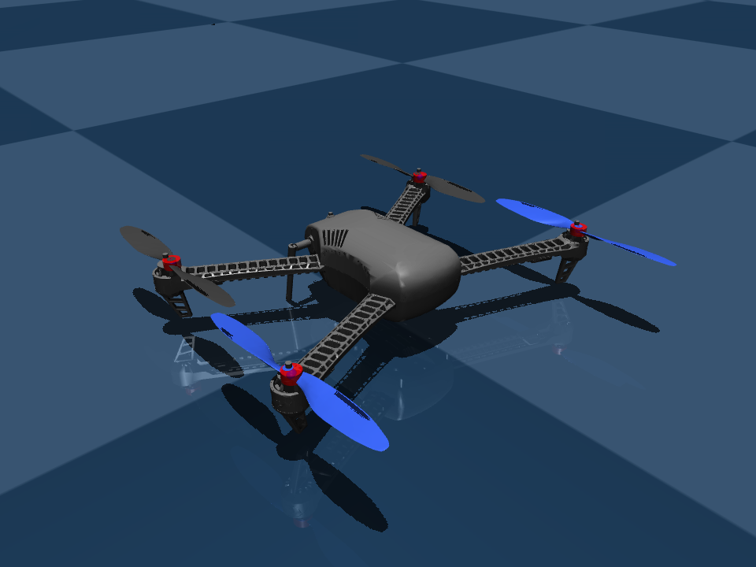
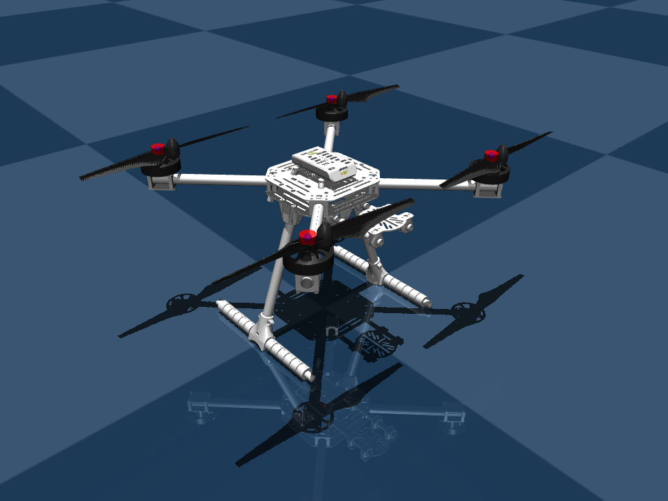
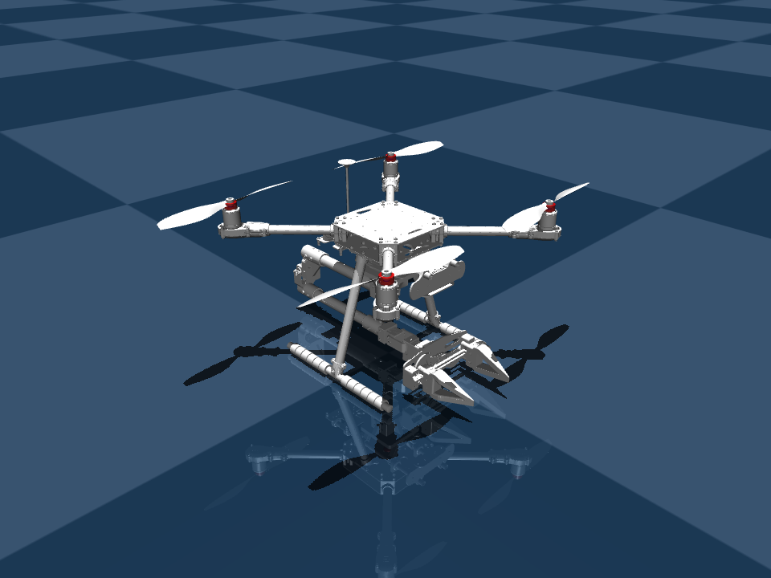
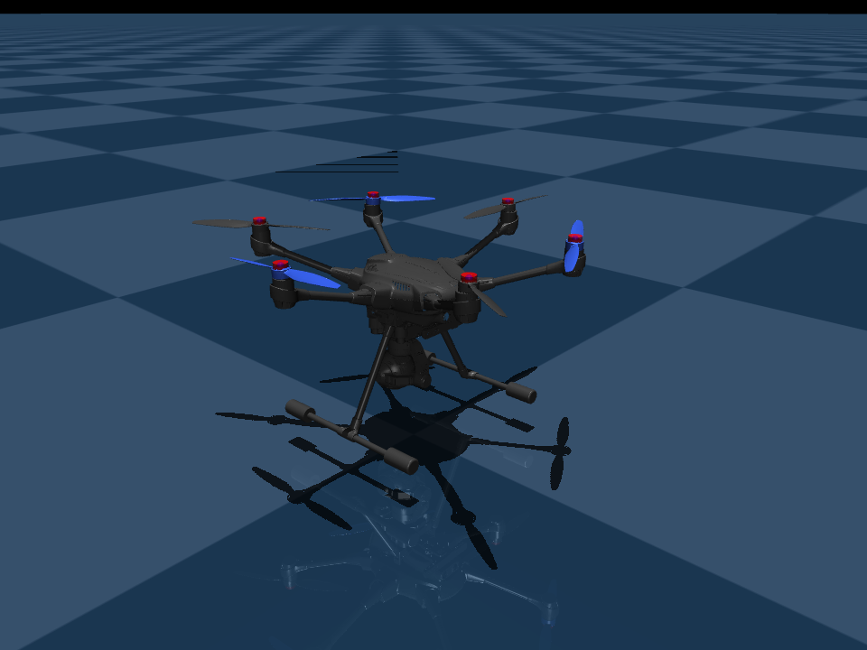
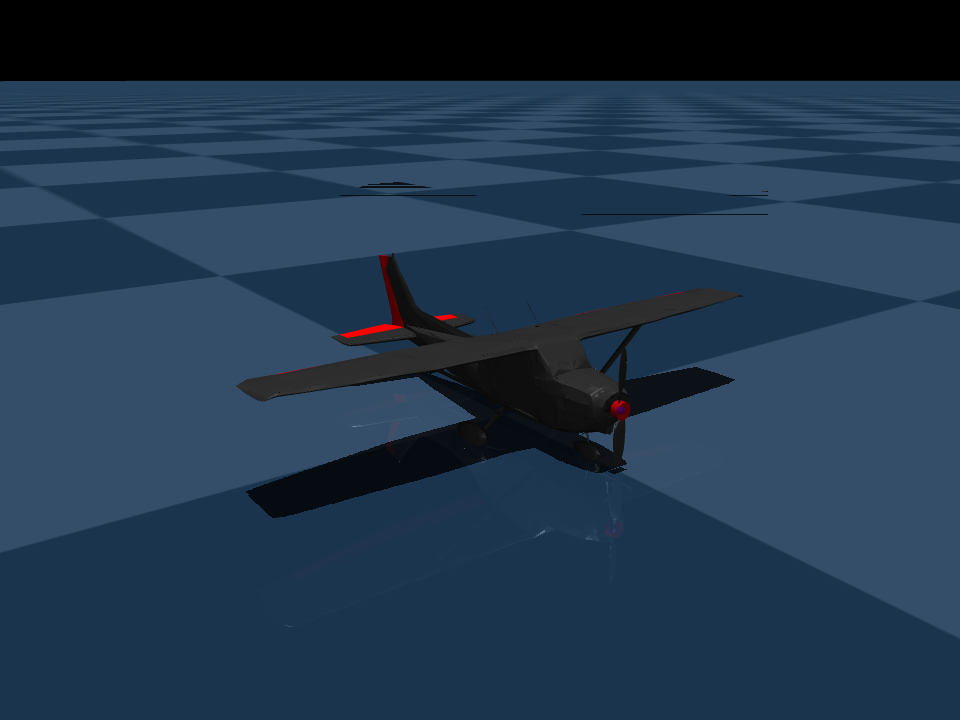
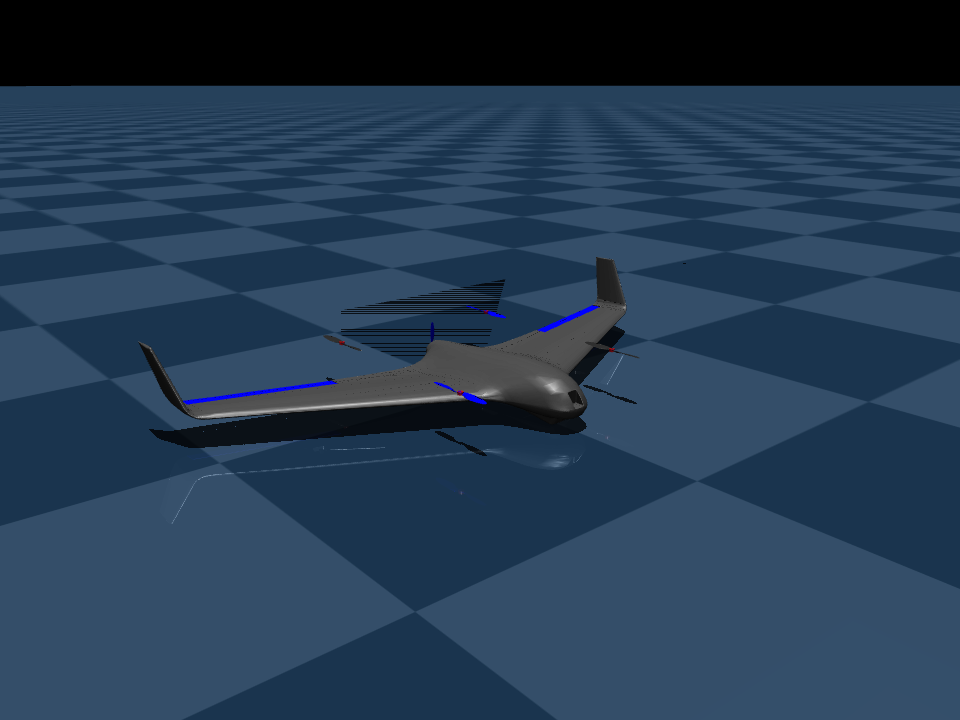
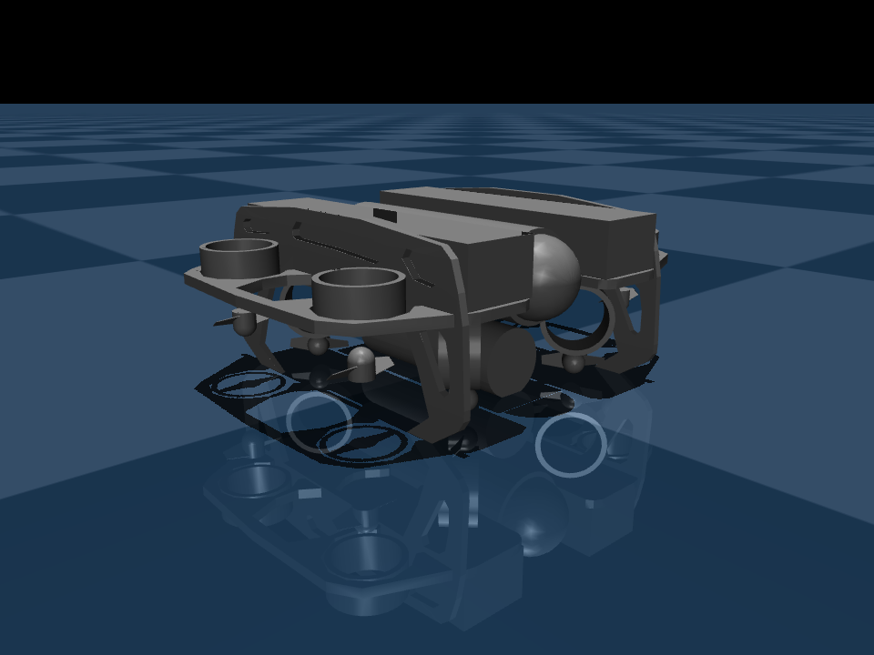

<a id="readme-top"></a>

<div align="center">

<p align="center">
  <a href="https://www.python.org/"></a>
  <a href="https://github.com/psf/black"></a>
  <a href="https://pre-commit.com/"></a>
</p>

<h1 align="center">ACESim</h1>

<p align="center">
  A MuJoCo / Genesis simulation platform for multi-domain vehicles.
</p>

<p align="center">
  <a href="README.md">简体中文</a>
  ·
  <strong>English</strong>
</p>

</div>

<details>
  <summary>Table of Contents</summary>
  <ol>
    <li><a href="#about-the-project">About The Project</a></li>
    <li><a href="#built-with">Built With</a></li>
    <li>
      <a href="#getting-started">Getting Started</a>
      <ul>
        <li><a href="#prerequisites">Prerequisites</a></li>
        <li><a href="#installation">Installation</a></li>
      </ul>
    </li>
    <li>
      <a href="#usage">Usage</a>
      <ul>
        <li><a href="#asset-gallery">Asset Gallery</a></li>
        <li><a href="#configuration">Configuration</a></li>
        <li><a href="#ros-2--px4">ROS 2 / PX4</a></li>
        <li><a href="#ue5-visual-stream-integration">UE5 Visual Stream Integration</a></li>
        <li><a href="#asset-toolchain">Asset Toolchain</a></li>
      </ul>
    </li>
    <li><a href="#roadmap">Roadmap</a></li>
    <li><a href="#contributing">Contributing</a></li>
    <li><a href="#license">License</a></li>
    <li><a href="#contact">Contact</a></li>
    <li><a href="#acknowledgments">Acknowledgments</a></li>
  </ol>
</details>

## About The Project

ACESim provides one entry point for environment assembly, simulation runtime, asset conversion, and deployment. It can run as a lightweight Python simulation package, or join a fuller flight-control workflow through ROS 2 launch files, bridge plugins, and PX4 repository integration.

Core capabilities:

- Supports both `mujoco` and `genesis` simulation backends.
- Supports `mc`, `am`, `fw`, `vtol`, and `uuv` environment types. `am` means AM, or Aerial Manipulator.
- Provides core assets such as `iris`, `x500`, `x500_arm2x`, `typhoon_h480`, `advanced_plane`, `standard_vtol`, and `uuv_bluerov2_heavy`.
- Uses ROS 2 for complete deployment workflows while still supporting direct Python entry points for local validation.
- Optionally integrates PX4 HIL, ROS 2 bridge flows, simulation clock sync, and SDF asset import workflows.

<p align="right">(<a href="#readme-top">back to top</a>)</p>

## Built With

Main runtime dependencies and ecosystem pieces:

- [Python](https://www.python.org/) 3.9+
- [MuJoCo](https://mujoco.org/)
- [Genesis](https://genesis-world.readthedocs.io/)
- [ROS 2](https://docs.ros.org/)
- [PX4](https://px4.io/)
- [NumPy](https://numpy.org/), [SciPy](https://scipy.org/), [pymavlink](https://github.com/ArduPilot/pymavlink), [pyzmq](https://pyzmq.readthedocs.io/)

The default install contains shared Python dependencies. Simulation backends are installed through extras when needed.

| Extra | Purpose | Main dependencies |
| --- | --- | --- |
| `.[mujoco]` | MuJoCo backend and README asset rendering | `mujoco`, `trimesh` |
| `.[genesis]` | Genesis backend | `genesis-world` |
| `.[all]` | MuJoCo and Genesis backends together | `mujoco`, `genesis-world`, `trimesh` |

<p align="right">(<a href="#readme-top">back to top</a>)</p>

## Getting Started

### Prerequisites

- Python 3.9 or newer.
- A working ROS 2 environment if you need ROS 2 launch files, bridges, or PX4 integration.
- The `.[mujoco]` extra if you want to use the default MuJoCo configuration.

### Installation

Clone the repository and install the default MuJoCo backend:

```bash
git clone https://github.com/Xiangyuan-Xie/ACESim.git
cd ACESim
pip install -e ".[mujoco]"
```

Install only the Genesis backend:

```bash
pip install -e ".[genesis]"
```

Install every backend at once:

```bash
pip install -e ".[all]"
```

Run the local Python entry point for a quick check:

```bash
python -m acesim.core.play
```

<p align="right">(<a href="#readme-top">back to top</a>)</p>

## Usage

### Asset Gallery

#### Multirotors and Manipulators

<table>
  <tr>
    <td align="center">
      <br />
      <strong><code>iris</code></strong><br />
      Quadrotor
    </td>
    <td align="center">
      <br />
      <strong><code>x500</code></strong><br />
      Quadrotor
    </td>
    <td align="center">
      <br />
      <strong><code>x500_arm2x</code></strong><br />
      Arm-equipped quadrotor
    </td>
  </tr>
  <tr>
    <td align="center">
      <br />
      <strong><code>typhoon_h480</code></strong><br />
      Hexrotor
    </td>
    <td align="center"></td>
    <td align="center"></td>
  </tr>
</table>

#### Fixed-Wing, VTOL, and UUV

<table>
  <tr>
    <td align="center">
      <br />
      <strong><code>advanced_plane</code></strong><br />
      Fixed-wing
    </td>
    <td align="center">
      <br />
      <strong><code>standard_vtol</code></strong><br />
      VTOL
    </td>
    <td align="center">
      <br />
      <strong><code>uuv_bluerov2_heavy</code></strong><br />
      UUV
    </td>
  </tr>
</table>

Regenerate the gallery images:

```bash
python -m acesim.tools.render_readme_assets
```

### Configuration

Both `python -m acesim.core.play` and the ROS 2 play entries read `acesim/config/default.toml`. The current defaults are:

```toml
[basic]
sim_type = "mujoco"
env_type = "am"
scene_name = "default"
asset_name = "x500_arm2x"
benchmark = "multirotor"
```

Core fields:

- `basic.sim_type`
  - Description: simulation backend.
  - Values: `mujoco`, `genesis`.
- `basic.env_type`
  - Description: environment type.
  - Values: `mc`, `am`, `fw`, `vtol`, `uuv`.
- `basic.scene_name`
  - Description: scene name.
- `basic.asset_name`
  - Description: asset parameter filename.
- `basic.benchmark`
  - Description: benchmark or runtime grouping field.

ACESim first reads the top-level `basic` configuration, then loads asset parameters from `acesim/config/<sim_type>/<asset_name>.toml`. To switch backend, environment type, or asset, start with the `basic` table in `default.toml`.

### ROS 2 / PX4

The ROS 2 package lives in `acesim/deploy/aircraft/acesim_ros2`. Use it for full deployment, bridge, clock-sync, and integration workflows:

```bash
ros2 launch acesim_ros2 linux.launch.py
```

Headless launch:

```bash
ros2 launch acesim_ros2 linux_headless.launch.py
```

Console entries:

- `acesim_play = acesim_ros2.acesim_play:main`
- `acesim_play_headless = acesim_ros2.acesim_play_headless:main`
- `acesim_bridge = acesim_ros2.acesim_bridge:main`
- `x500_arm2x_benchmark = acesim_ros2.benchmark.x500_arm2x:main`

PX4 integration is supported, but optional. The main PX4-facing logic is organized in:

- `acesim/utils/px4_transport.py`
- `acesim/utils/px4_sensor_scheduler.py`

When no PX4 repository path is provided explicitly, the ROS 2 launch logic tries this default path:

```text
acesim/third_party/aircraft/PX4-Autopilot
```

For ACESim AM Position:

- A valid manual-control source is required, such as QGC virtual joystick or RC.
- This requirement is fixed by the mode implementation and follows Position mode behavior; it is not overridden by launch arguments.
- Centering the stick does not block mode entry. It enters hold behavior instead.
- If `.msg` or `.srv` interfaces under `acesim/deploy/aircraft/px4_msgs` change, the ROS 2 workspace needs one clean rebuild.

### UE5 Visual Stream Integration

UE5 is used as the rendering frontend, while ACESim / MuJoCo remains the dynamics authority. See `acesim/third_party/unreal/ACESimUE/README.md` for the complete bridge workflow, ACESimUE submodule project management, and reserved sensor-feedback endpoints.

UE rendering launch:

```bash
ros2 launch acesim_ros2 linux_ue.launch.py
```

Default packaged runtime path:

```text
/home/xxy/ACESim-unreal/packages/ACESimUE-Linux/Linux/ACESimUE/Binaries/Linux/ACESimUE
```

Package the runtime first if it does not exist yet:

```bash
bash acesim/third_party/unreal/ACESimUE/Tools/package_ue_runtime.sh
```

Editor development mode requires `ue_mode:=editor`. It launches `UnrealEditor <uproject> -game`, and the first run may trigger shader / DDC compilation.

UE5-related tools live in:

- `acesim/third_party/unreal/ACESimUE`
- `acesim/third_party/unreal/ACESimUE/README.md`
- `acesim/third_party/unreal/ACESimUE/Tools/check_ubuntu_ue5_host.sh`
- `acesim/third_party/unreal/ACESimUE/Tools/setup_ubuntu_ue5.sh`
- `acesim/third_party/unreal/ACESimUE/Tools/package_ue_runtime.sh`
- `acesim/third_party/unreal/ACESimUE/Tools/verify_visual_stream.py`
- `acesim/third_party/unreal/ACESimUE/Tools/verify_ue_runtime_visual.py`

`UnrealEngine` itself is not managed as a submodule in this repository. It remains at `/home/xxy/ACESim-unreal/UnrealEngine` by default. The ACESim UE project source is maintained in the `acesim/third_party/unreal/ACESimUE` submodule and is used directly as the UE Editor, UBT, and UAT work project.

After first pulling the UE submodule, fetch its Git LFS assets and run one asset preflight check:

```bash
git -C acesim/third_party/unreal/ACESimUE lfs pull
python3 acesim/third_party/unreal/ACESimUE/Tools/verify_acesim_assets.py
```

For a visual-stream link check, start with:

```bash
python3 acesim/third_party/unreal/ACESimUE/Tools/verify_visual_stream.py --samples 5 --timeout-sec 10
```

Read `acesim/third_party/unreal/ACESimUE/README.md` when setting up the UE5 runtime. For daily ROS 2 use, package first, then start the packaged runtime with `ros2 launch acesim_ros2 linux_ue.launch.py`.

### Asset Toolchain

Common tools in this repository:

- `acesim.tools.sdf2urdf`: stage-1 converter that syncs ACESim-maintained URDF assets from SDF source truth.
- `acesim.tools.urdf2mjcf`: stage-2 converter that consumes URDF, compiles MuJoCo assets, and applies MJCF post-processing.
- `acesim.tools.render_readme_assets`: renders README asset previews.
- `acesim/tools/cal_dynamic_params.py`: helper for dynamics parameters.
- `acesim/tools/cal_thrust_coef.py`: helper for thrust coefficients.

Running `python -m acesim.tools.sdf2urdf` or `python -m acesim.tools.urdf2mjcf` without arguments opens that tool's BIOS-style TUI by default.

The current `sdf2urdf` interface is designed for general SDF sources, but the provider already implemented in this repository is mainly `px4`.

Minimal two-stage workflow:

```bash
python -m acesim.tools.sdf2urdf --source px4 --target advanced_plane
python -m acesim.tools.urdf2mjcf --target advanced_plane
```

Responsibility split:

- `sdf2urdf`: reads upstream SDF truth, generates or syncs local meshes, and updates the URDF used by ACESim.
- `urdf2mjcf`: starts from prepared URDF input, then completes MuJoCo compilation and MJCF post-processing.

If you only need to correct upstream SDF visual, joint, or inertial truth, run `sdf2urdf` first. Continue with `urdf2mjcf` when you also need to refresh MuJoCo asset outputs.

<p align="right">(<a href="#readme-top">back to top</a>)</p>

## Roadmap

- [x] MuJoCo default configuration and multi-asset headless startup.
- [x] ROS 2 launch, bridge plugins, and simulation clock sync.
- [x] PX4 sensor scheduling and actuator-control reads.
- [x] PX4 SDF asset import pipeline.
- [x] `x500_arm2x` benchmark launch and console script.
- [ ] Expand Genesis backend asset coverage and runtime documentation.
- [ ] Add benchmark profiles and reproducible experiment notes for more task scenarios.

<p align="right">(<a href="#readme-top">back to top</a>)</p>

## Contributing

Issues, fixes, and improvements are welcome. Recommended local workflow:

1. Create a branch and make your changes.
2. Run tests:

   ```bash
   pytest
   ```

3. Run code-quality checks:

   ```bash
   pip install pre-commit
   pre-commit install
   pre-commit run --all-files
   ```

4. Describe the context, impact, and verification in the commit message or pull request.

Current tests cover packaging metadata, configuration loading, MuJoCo default configuration and multi-asset headless startup, PX4 sensor scheduling, PX4 SDF asset import, ROS 2 launch assembly, bridge runtime, visual-stream payload encoding and decoding, and key fixed-wing, VTOL, and UUV dynamics behaviors.

See [`AGENT.md`](AGENT.md) for additional code-agent collaboration conventions.

<p align="right">(<a href="#readme-top">back to top</a>)</p>

## License

ACESim-owned code and documentation are released under the [Apache License 2.0](LICENSE).

Third-party source code, vendored ROS 2 message definitions, and external assets keep their original license notices in their own directories, such as license files under `acesim/third_party/` and `acesim/deploy/aircraft/px4_msgs/`.

<p align="right">(<a href="#readme-top">back to top</a>)</p>

## Contact

Maintainer: Xiangyuan Xie

- Email: <dragonboat_xxy@163.com>
- Project Link: <https://github.com/Xiangyuan-Xie/ACESim>

<p align="right">(<a href="#readme-top">back to top</a>)</p>

## Acknowledgments

- [othneildrew/Best-README-Template](https://github.com/othneildrew/Best-README-Template) inspired the section structure of these README files.
- MuJoCo, Genesis, PX4, ROS 2, and their ecosystems provide the core foundation for ACESim simulation, deployment, and flight-control integration workflows.

<p align="right">(<a href="#readme-top">back to top</a>)</p>
